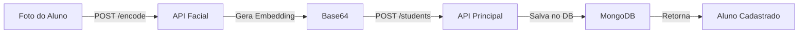
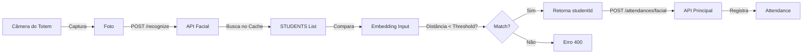

# 🔍 Documentação da API Facial - Presença Facial SENAI

## Índice
- [Informações Gerais](#informações-gerais)
- [Autenticação](#autenticação)
- [Health Check](#health-check)
- [Endpoints](#endpoints)
  - [Gerar Embedding Facial](#gerar-embedding-facial-encode)
  - [Reconhecer Aluno](#reconhecer-aluno-recognize)
- [Fluxos de Integração](#fluxos-de-integração)
- [Cache de Alunos](#cache-de-alunos)
- [Modelos de Dados](#modelos-de-dados)

---

## Informações Gerais

**Framework:** FastAPI (Python)

**Base URL:** `http://localhost:8000`

**Porta:** `8000`

**Propósito:** API especializada em reconhecimento facial e geração de embeddings para o sistema de presença facial SENAI

**Padrão de Resposta:**
- **Sucesso (200):**
  ```json
  {
    "embedding": "base64_encoded_string",
    "studentId": "507f1f77bcf86cd799439014"
  }
  ```

- **Erro (400/401):**
  ```json
  {
    "detail": "Descrição do erro"
  }
  ```

---

## Autenticação

### API Key Header
- **Header:** `x-facial-api-key`
- **Tipo:** String
- **Obrigatório para:** `/encode` (geração de embedding)
- **Exemplo:**
  ```bash
  curl -X POST http://localhost:8000/encode \
    -H "x-facial-api-key: sua-chave-aqui" \
    -F "image=@foto.jpg"
  ```

### Validação
```python
def verify_api_key(x_facial_api_key: str = Header(...)):
    if x_facial_api_key != FACIAL_API_KEY:
        raise HTTPException(
            status_code=401,
            detail="Invalid API Key"
        )
```

---

## Health Check

### GET /health

Verifica se a API está funcionando e responsiva.

**Autenticação:** Nenhuma

**Resposta (200 OK):**
```json
{
  "status": "ok"
}
```

**Uso:**
```bash
curl http://localhost:8000/health
```

---

## Endpoints

### Gerar Embedding Facial (Encode)

#### POST /encode

Gera um embedding facial (vetorização) a partir de uma imagem.

**Autenticação:** `x-facial-api-key` (obrigatório)

**Uso:** Integração com API principal para cadastro de alunos

**Request (Form Data):**
- `image` - Arquivo de imagem (JPG, PNG) contendo um único rosto (obrigatório)

**Fluxo:**
1. Recebe arquivo de imagem
2. Carrega imagem em memória (temporário)
3. Detecta rosto usando `face_recognition.load_image_file()`
4. Gera embedding 128-dimensional usando `face_recognition.face_encodings()`
5. Converte embedding para base64
6. Retorna embedding codificado
7. Deleta arquivo temporário

**Resposta (200 OK):**
```json
{
  "embedding": "AAAAAAAA/z8AAAAAAAAAP8AAAAAAAAA/QAAAAAAAAD/AAAAAAAAAP8AAAAAAAAAP8AAAAAAAAAP8AAAAAAAAAP..."
}
```

**Exemplo cURL:**
```bash
curl -X POST http://localhost:8000/encode \
  -H "x-facial-api-key: sua-chave-secreta" \
  -F "image=@aluno.jpg"
```

**Exemplo Python:**
```python
import requests

with open('aluno.jpg', 'rb') as f:
    files = {'image': f}
    headers = {'x-facial-api-key': 'sua-chave-secreta'}
    response = requests.post(
        'http://localhost:8000/encode',
        files=files,
        headers=headers
    )
    
embedding_base64 = response.json()['embedding']
print(f"Embedding gerado: {embedding_base64[:50]}...")
```

**Exemplo JavaScript (Frontend):**
```javascript
const formData = new FormData();
formData.append('image', imageFile);

const response = await fetch('http://localhost:8000/encode', {
  method: 'POST',
  headers: {
    'x-facial-api-key': 'sua-chave-secreta'
  },
  body: formData
});

const data = await response.json();
const embedding = data.embedding;
```

**Possíveis Erros:**

- **400 Bad Request** - Nenhum rosto detectado
  ```json
  {
    "detail": "Nenhum rosto detectado na imagem"
  }
  ```

- **400 Bad Request** - Múltiplos rostos detectados
  ```json
  {
    "detail": "Mais de um rosto detectado na imagem"
  }
  ```

- **401 Unauthorized** - API Key inválida ou ausente
  ```json
  {
    "detail": "Invalid API Key"
  }
  ```

**Características Técnicas:**
- Embedding: vetor de 128 dimensões (float32)
- Formato de saída: Base64 (para transmissão por HTTP)
- Detecção: usa CNN (Convolutional Neural Network) do `dlib`
- Encoding: usa modelo deep learning pré-treinado
- Arquivo temporário é deletado automaticamente

---

### Reconhecer Aluno (Recognize)

#### POST /recognize

Identifica um aluno a partir de uma foto capturada pelo totem.

**Autenticação:** Nenhuma (endpoint público do totem)

**Uso:** Chamado pelo totem para reconhecer alunos em tempo real

**Request (Form Data):**
- `room` - ObjectId da sala (obrigatório)
- `image` - Arquivo de imagem contendo um rosto (obrigatório)

**Fluxo:**
1. Recebe imagem da câmera do totem
2. Gera embedding da imagem recebida (128D)
3. Filtra cache de alunos pela sala (room_id)
4. Calcula distância euclidiana para todos os alunos candidatos
5. Encontra o aluno com menor distância
6. Valida contra threshold (padrão: 0.6)
7. Retorna apenas o `studentId` se encontrado
8. Retorna `null` ou erro se não encontrado

**Resposta (200 OK - Aluno Identificado):**
```json
{
  "studentId": "507f1f77bcf86cd799439014"
}
```

**Exemplo cURL:**
```bash
curl -X POST http://localhost:8000/recognize \
  -F "room=507f1f77bcf86cd799439013" \
  -F "image=@captura_totem.jpg"
```

**Exemplo Python:**
```python
import requests

room_id = "507f1f77bcf86cd799439013"

with open('captura.jpg', 'rb') as f:
    files = {'image': f}
    data = {'room': room_id}
    
    response = requests.post(
        'http://localhost:8000/recognize',
        files=files,
        data=data
    )
    
    if response.status_code == 200:
        student_id = response.json()['studentId']
        print(f"Aluno identificado: {student_id}")
    else:
        print(f"Erro: {response.json()['detail']}")
```

**Exemplo JavaScript (Frontend/Totem):**
```javascript
const formData = new FormData();
formData.append('room', roomId);
formData.append('image', capturedImage);

const response = await fetch('http://localhost:8000/recognize', {
  method: 'POST',
  body: formData
});

if (response.ok) {
  const { studentId } = await response.json();
  console.log(`Aluno reconhecido: ${studentId}`);
  // Enviar para API principal para registrar presença
} else {
  const error = await response.json();
  console.error(`Erro: ${error.detail}`);
}
```

**Possíveis Erros:**

- **400 Bad Request** - Nenhum rosto detectado
  ```json
  {
    "detail": "Nenhum rosto detectado na imagem"
  }
  ```

- **400 Bad Request** - Múltiplos rostos na imagem
  ```json
  {
    "detail": "Mais de um rosto detectado na imagem"
  }
  ```

- **400 Bad Request** - Aluno não encontrado (distância > threshold)
  ```json
  {
    "detail": "Aluno não encontrado"
  }
  ```

- **400 Bad Request** - Nenhum candidato na sala
  ```json
  {
    "detail": "Nenhum aluno registrado para esta sala"
  }
  ```

**Algoritmo de Reconhecimento:**

```python
def recognize_student(room_id: str, image_bytes: bytes) -> str | None:
    # 1. Gera embedding da imagem capturada
    input_embedding = generate_embedding_from_image(image_bytes)
    
    # 2. Filtra alunos da sala (lookup no cache)
    candidates = [s for s in STUDENTS if room_id in s.rooms]
    
    if not candidates:
        return None
    
    # 3. Cria matrix com todos os embeddings (N x 128)
    embeddings = np.vstack([s.facial for s in candidates])
    
    # 4. Calcula distância euclidiana vetorizada
    distances = np.linalg.norm(embeddings - input_embedding, axis=1)
    
    # 5. Encontra o melhor match
    best_index = np.argmin(distances)
    best_distance = distances[best_index]
    
    # 6. Valida contra threshold
    if best_distance > FACE_MATCH_THRESHOLD:  # default: 0.6
        return None
    
    return candidates[best_index].id
```

**Características Técnicas:**
- **Threshold:** Distância euclidiana máxima de 0.6 (configurável em `settings.py`)
- **Cache:** Usa lista em memória (STUDENTS) sincronizada periodicamente
- **Performance:** O(N) onde N = alunos na sala
- **Otimização:** Cálculo vetorizado com NumPy
- **Latência esperada:** <500ms (depende do hardware)

---

## Fluxos de Integração

### Fluxo 1: Cadastro de Aluno com Foto



**Passo a Passo:**

1. **Capturar foto do aluno**
   ```json
   {
     "file": "aluno.jpg"
   }
   ```

2. **Enviar para /encode**
   ```bash
   POST http://localhost:8000/encode
   x-facial-api-key: <key>
   Content-Type: multipart/form-data
   
   image: <arquivo>
   ```

3. **Receber embedding**
   ```json
   {
     "embedding": "AAAAA...base64...AAAA"
   }
     ```

4. **Salvar aluno com embedding**
   ```bash
   POST http://localhost:3000/api/students
   Authorization: <jwt-token>
   Content-Type: application/json
   
   {
     "name": "João Silva",
     "registration": "2025001",
     "facialId": "AAAAA...base64...AAAA",
     "classCode": "I2P4"
   }
   ```

### Fluxo 2: Reconhecimento em Tempo Real (Totem)



**Passo a Passo:**

1. **Totem captura foto**
   ```
   Câmera detecta rosto → foto.jpg
   ```

2. **Enviar para /recognize**
   ```bash
   POST http://localhost:8000/recognize
   Content-Type: multipart/form-data
   
   room: 507f1f77bcf86cd799439013
   image: <captura.jpg>
   ```

3. **Receber studentId**
   ```json
   {
     "studentId": "507f1f77bcf86cd799439014"
   }
   ```

4. **Registrar presença na API principal**
   ```bash
   POST http://localhost:3000/api/attendances/facial
   x-totem-api-key: <totem-key>
   Content-Type: multipart/form-data
   
   room: 507f1f77bcf86cd799439013
   image: <captura.jpg>
   ```

### Fluxo 3: Sincronização de Cache


**Intervalo de Sincronização:** 60 segundos (configurável em `.env` via `SYNC_INTERVAL_SECONDS`)

**O que é Sincronizado:**
- ID do aluno (`_id`)
- Embedding facial em base64 (`facial`)
- Lista de salas (`rooms`)

---

## Cache de Alunos

### Estrutura

O cache é mantido em memória em uma variável global `STUDENTS` durante a execução da API.

```python
# Estrutura em memória
STUDENTS: List[StudentEmbedding] = [
    {
        "id": "507f1f77bcf86cd799439014",
        "facial": np.ndarray([...128 valores float32...]),
        "rooms": ["507f1f77bcf86cd799439013", "507f1f77bcf86cd799439014"]
    },
    {...}
]
```

### Sincronização Automática

**Quando ocorre:**
- ✅ Na inicialização da API (startup)
- ✅ A cada 60 segundos (configurável)
- ❌ Não é sincronizado em eventos em tempo real

**Como ocorre:**
1. GET `http://localhost:3000/api/students/faces` (autenticado com `x-facial-api-key`)
2. Recebe lista completa de alunos com embeddings em base64
3. Decodifica base64 → NumPy arrays
4. Substitui cache atomicamente (`STUDENTS.clear()` + `STUDENTS.extend()`)

**Vantagens:**
- ⚡ Reconhecimento rápido (O(N) em vez de DB query)
- 🔄 Sincronização automática
- 🛡️ Isolado de falhas da API principal

**Desvantagens:**
- ⏱️ Delay de até 60 segundos para novos alunos
- 💾 Usa RAM (tamanho = N alunos × 128 float32 ≈ 512 bytes/aluno)

**Exemplo de Resposta de Sincronização:**
```json
{
  "success": true,
  "message": "",
  "data": [
    {
      "_id": "507f1f77bcf86cd799439014",
      "name": "João Silva",
      "facial": "AAAAA...base64...AAAA",
      "rooms": ["507f1f77bcf86cd799439013"]
    },
    {
      "_id": "507f1f77bcf86cd799439015",
      "name": "Maria Santos",
      "facial": "BBBBB...base64...BBBBB",
      "rooms": ["507f1f77bcf86cd799439013", "507f1f77bcf86cd799439014"]
    }
  ]
}
```

---

## Modelos de Dados

### StudentEmbedding

Modelo de aluno armazenado no cache em memória.

```python
class StudentEmbedding(BaseModel):
    id: str                    # ObjectId do aluno (MongoDB)
    facial: np.ndarray         # Embedding 128-dimensional
    rooms: List[str]           # Lista de ObjectIds de salas
    
    class Config:
        arbitrary_types_allowed = True  # Permite np.ndarray
```

**Exemplo em Memória:**
```python
StudentEmbedding(
    id="507f1f77bcf86cd799439014",
    facial=np.array([0.1, -0.2, 0.5, ...], dtype=np.float32),  # 128 valores
    rooms=["507f1f77bcf86cd799439013", "507f1f77bcf86cd799439014"]
)
```

### Embedding

Representação matemática do rosto de uma pessoa.

**Características:**
- Dimensionalidade: 128
- Tipo: float32 (32-bit floating point)
- Interpretação: ponto em espaço 128-dimensional
- Distância: euclidiana (quanto menor, mais similar)
- Codificação para transmissão: Base64

**Exemplo de Embedding (decodificado):**
```python
array([
    0.12345678,  -0.23456789,   0.34567890,  -0.45678901,
    0.56789012,  -0.67890123,   0.78901234,  -0.89012345,
    ...
], dtype=float32)  # 128 valores no total
```

---

## Variáveis de Ambiente

### Arquivo `.env`

```env
# API Key para autenticação
FACIAL_API_KEY=sua-chave-secreta-aqui

# URL da API principal
MAIN_API_URL=http://localhost:3000/api

# Intervalo de sincronização de cache (segundos)
SYNC_INTERVAL_SECONDS=60

# Threshold de confiança para reconhecimento
FACE_MATCH_THRESHOLD=0.6
```

### Descrição de Variáveis

| Variável | Tipo | Padrão | Descrição |
|----------|------|--------|-----------|
| `FACIAL_API_KEY` | string | - | Chave secreta para o endpoint `/encode` |
| `MAIN_API_URL` | string | - | URL base da API Node.js principal (ex: http://localhost:3000/api) |
| `SYNC_INTERVAL_SECONDS` | int | 60 | Intervalo em segundos entre sincronizações de cache |
| `FACE_MATCH_THRESHOLD` | float | 0.6 | Distância máxima euclidiana para considerar um match válido |

---

## Dependências

### requirements.txt

```
fastapi          # Framework web assíncrono
uvicorn          # Servidor ASGI
python-dotenv    # Carrega variáveis de .env
face_recognition # Detecta e codifica rostos (usa dlib + CNN)
numpy            # Computação vetorizada (cálculo de distâncias)
httpx            # Cliente HTTP assíncrono (sincronização)
```

### Instalação

```bash
pip install -r requirements.txt
```

---

## Execução

### Desenvolvimento

```bash
# Navegar para a pasta
cd facial

# Instalar dependências
pip install -r requirements.txt

# Executar com auto-reload
uvicorn main:app --reload --port 8000

# Acesso:
# API: http://localhost:8000
# Docs: http://localhost:8000/docs (Swagger UI)
# OpenAPI: http://localhost:8000/openapi.json
```

### Produção

```bash
# Com workers
uvicorn main:app --host 0.0.0.0 --port 8000 --workers 4

# Com gunicorn (recomendado para produção)
gunicorn -w 4 -k uvicorn.workers.UvicornWorker main:app --bind 0.0.0.0:8000
```

---

## Monitoramento

### Logs de Sincronização

A API exibe logs automáticos a cada sincronização:

```
[SYNC] Students synchronized successfully
[SYNC] Next sync in 60 seconds
[SYNC] Total students cached: 42
```

### Logs de Erro

```
[SYNC ERROR] Connection refused (conexão com API principal falhou)
[SYNC ERROR] Invalid API Key (chave de autenticação inválida)
```

### Health Check

Monitore a saúde da API periodicamente:

```bash
# A cada 10 segundos
while true; do 
  curl -s http://localhost:8000/health | jq .
  sleep 10
done
```

---

## Segurança

### Boas Práticas

✅ **Faça:**
- Armazene `FACIAL_API_KEY` em variáveis de ambiente
- Use HTTPS em produção
- Valide tamanho de arquivo de imagem (máx. 5MB)
- Implemente rate limiting para `/recognize`
- Monitore latência de sincronização

❌ **Evite:**
- Incluir API Key no código-fonte
- Expor logs com chaves sensíveis
- Aceitar uploads ilimitados
- Deixar `/recognize` aberto para qualquer IP (use firewall)

### Proteção de Endpoints

| Endpoint | Autenticação | Uso |
|----------|--------------|-----|
| `/health` | Nenhuma | Health check público |
| `/encode` | x-facial-api-key | Apenas API principal |
| `/recognize` | Nenhuma | Totens (recomenda-se firewall) |

---

## Performance e Otimizações

### Latência Esperada

| Operação | Latência |
|----------|----------|
| `/health` | <10ms |
| `/encode` (detecção + embedding) | 200-500ms |
| `/recognize` (N=50 alunos) | 100-300ms |
| Sincronização de cache | 500ms-2s (depende da API principal) |

### Fatores que Afetam Performance

**Aumentam latência:**
- 📸 Imagens de alta resolução
- 👥 Muitos candidatos na sala (N)
- 🌐 Latência de rede (sincronização)
- 💻 CPU limitada (face_recognition é CPU-bound)

**Reduzem latência:**
- ⚡ Cache em memória (vs. DB query)
- 🔢 Cálculo vetorizado NumPy
- 🔄 Sincronização assíncrona

### Estimativas de Uso de Memória

```
Cache RAM ≈ N_alunos × (128 float32 + overhead)
          ≈ N_alunos × 512 bytes

Exemplos:
- 100 alunos   ≈ 51 KB
- 1000 alunos  ≈ 512 KB
- 10000 alunos ≈ 5 MB
```

---

## Troubleshooting

### Problema: "Nenhum rosto detectado"
**Causa:** Imagem de má qualidade, rosto muito pequeno ou ângulo desfavorável
**Solução:** 
- Use imagens de resolução ≥ 640x480
- Posicione o rosto no centro da imagem
- Iluminação adequada
- Distância apropriada (40-60cm no totem)

### Problema: "Mais de um rosto detectado"
**Causa:** Múltiplas pessoas na imagem
**Solução:** 
- Capture apenas um rosto
- Melhore o enquadramento da câmera do totem

### Problema: Aluno não é reconhecido
**Causa:** Distância euclidiana > threshold (0.6)
**Soluções:**
- Recapture a foto de cadastro em iluminação similar
- Aumente o threshold em `.env` (ex: 0.7)
- Verifique se o aluno está cadastrado
- Confirme se o aluno está associado à sala

### Problema: Cache não sincroniza
**Causa:** Falha de conexão com API principal
**Solução:**
- Verifique `MAIN_API_URL` em `.env`
- Confirme que a API Node.js está rodando
- Valide `FACIAL_API_KEY`
- Verifique logs: `[SYNC ERROR]`

### Problema: Timeout em /recognize
**Causa:** Muitos candidatos ou imagem muito grande
**Solução:**
- Otimize o tamanho da imagem (<2MB)
- Reduza número de alunos por sala
- Aumente timeout da requisição

---

## Integração com Postman

### Collection JSON

Você pode importar essas requisições no Postman:

```json
{
  "info": {
    "name": "API Facial SENAI",
    "schema": "https://schema.getpostman.com/json/collection/v2.1.0/collection.json"
  },
  "item": [
    {
      "name": "Health Check",
      "request": {
        "method": "GET",
        "url": {
          "raw": "http://localhost:8000/health",
          "protocol": "http",
          "host": ["localhost"],
          "port": "8000",
          "path": ["health"]
        }
      }
    },
    {
      "name": "Encode Face",
      "request": {
        "method": "POST",
        "header": [
          {
            "key": "x-facial-api-key",
            "value": "sua-chave-aqui"
          }
        ],
        "body": {
          "mode": "formdata",
          "formdata": [
            {
              "key": "image",
              "type": "file",
              "src": "aluno.jpg"
            }
          ]
        },
        "url": {
          "raw": "http://localhost:8000/encode",
          "protocol": "http",
          "host": ["localhost"],
          "port": "8000",
          "path": ["encode"]
        }
      }
    },
    {
      "name": "Recognize Face",
      "request": {
        "method": "POST",
        "body": {
          "mode": "formdata",
          "formdata": [
            {
              "key": "room",
              "value": "507f1f77bcf86cd799439013"
            },
            {
              "key": "image",
              "type": "file",
              "src": "captura.jpg"
            }
          ]
        },
        "url": {
          "raw": "http://localhost:8000/recognize",
          "protocol": "http",
          "host": ["localhost"],
          "port": "8000",
          "path": ["recognize"]
        }
      }
    }
  ]
}
```

---

## Exemplos Práticos Completos

### Exemplo 1: Cadastro de Aluno Completo

```bash
#!/bin/bash

# 1. Gerar embedding da foto
EMBEDDING=$(curl -s -X POST http://localhost:8000/encode \
  -H "x-facial-api-key: sua-chave-aqui" \
  -F "image=@aluno.jpg" | jq -r '.embedding')

echo "Embedding gerado: ${EMBEDDING:0:50}..."

# 2. Registrar aluno na API principal
curl -X POST http://localhost:3000/api/students \
  -H "Authorization: Bearer $TOKEN" \
  -H "Content-Type: application/json" \
  -d "{
    \"name\": \"João Silva\",
    \"registration\": \"2025001\",
    \"facialId\": \"$EMBEDDING\",
    \"classCode\": \"I2P4\"
  }"
```

### Exemplo 2: Reconhecimento com Retry

```python
import requests
import time

def recognize_with_retry(room_id: str, image_path: str, max_retries=3):
    for attempt in range(max_retries):
        try:
            with open(image_path, 'rb') as f:
                files = {'image': f}
                data = {'room': room_id}
                
                response = requests.post(
                    'http://localhost:8000/recognize',
                    files=files,
                    data=data,
                    timeout=10
                )
                
                if response.status_code == 200:
                    return response.json()['studentId']
                elif response.status_code == 400:
                    # Erro de reconhecimento (não é falha da API)
                    return None
                else:
                    raise Exception(f"Status {response.status_code}")
                    
        except Exception as e:
            if attempt < max_retries - 1:
                print(f"Tentativa {attempt + 1} falhou, retentando em 1s...")
                time.sleep(1)
            else:
                print(f"Falha permanente: {e}")
                return None
    
    return None

# Uso
student_id = recognize_with_retry(
    room_id="507f1f77bcf86cd799439013",
    image_path="captura.jpg"
)
```

### Exemplo 3: Monitoramento de Cache

```python
import requests
import time
from datetime import datetime

def monitor_cache():
    """Monitora tamanho do cache a cada 60 segundos"""
    
    while True:
        try:
            # Faz uma requisição de reconhecimento "dummy"
            # para verificar se a API está respondendo
            response = requests.get(
                'http://localhost:8000/health',
                timeout=5
            )
            
            if response.status_code == 200:
                timestamp = datetime.now().strftime("%H:%M:%S")
                print(f"[{timestamp}] ✓ API Facial funcionando")
            else:
                print(f"[{timestamp}] ✗ API retornou {response.status_code}")
                
        except Exception as e:
            print(f"[{timestamp}] ✗ Erro: {e}")
        
        time.sleep(60)

if __name__ == "__main__":
    monitor_cache()
```

---

## Códigos de Status HTTP

| Código | Descrição | Situação |
|--------|-----------|----------|
| 200 | OK | Requisição bem-sucedida, reconhecimento realizado |
| 400 | Bad Request | Sem rosto detectado, múltiplos rostos, ou aluno não encontrado |
| 401 | Unauthorized | API Key inválida (`/encode` apenas) |
| 422 | Unprocessable Entity | Campo obrigatório ausente |
| 500 | Internal Server Error | Erro no servidor |

---

## Roadmap de Melhorias

### Curto Prazo
- [ ] Suporte a múltiplos rostos (retornar lista de candidatos)
- [ ] Endpoint para delete/atualizar cache manualmente
- [ ] Métricas de performance (latência, taxa de acerto)

### Médio Prazo
- [ ] WebSocket para sincronização em tempo real
- [ ] Compressão de embeddings (reduzir tamanho)
- [ ] API para fine-tuning de threshold por sala

### Longo Prazo
- [ ] Modelo de rede neural customizado
- [ ] GPU support para processamento mais rápido
- [ ] Distributed cache (Redis)
- [ ] Multi-face recognition (reconhecer múltiplas pessoas)

---

## Referências

### Bibliotecas Utilizadas

- **face_recognition**: Interface de alto nível para dlib
  - Detecção: CNN-based face detector
  - Encoding: Deep learning model (ResNet-based)
  - Documentação: https://github.com/ageitgey/face_recognition

- **NumPy**: Computação científica eficiente
  - Documentação: https://numpy.org/doc/

- **FastAPI**: Framework web moderno
  - Documentação: https://fastapi.tiangolo.com/
  - Tutorial: https://fastapi.tiangolo.com/tutorial/

### Conceitos

- Embedding facial: Representação vetorial de um rosto
- Distância euclidiana: Métrica de similaridade entre vetores
- Threshold: Valor de corte para decisão de match
- Cache em memória: Armazenamento rápido de dados frequentes

---

**Última atualização:** 15 de Dezembro de 2025  
**Versão da API:** 1.0  
**Ambiente:** Desenvolvimento / Produção
